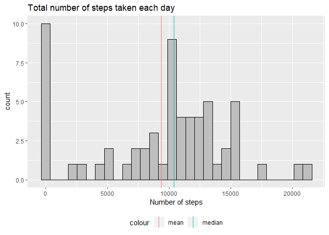
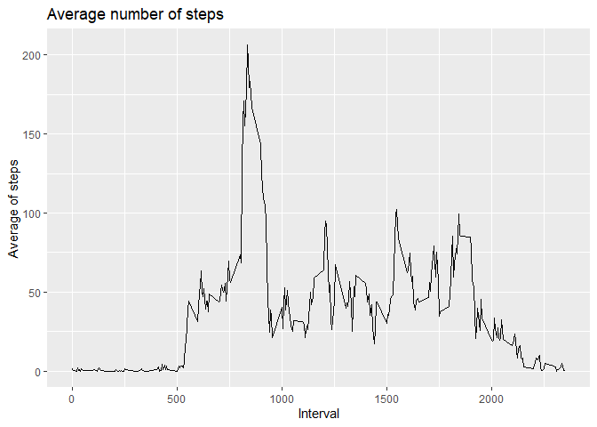
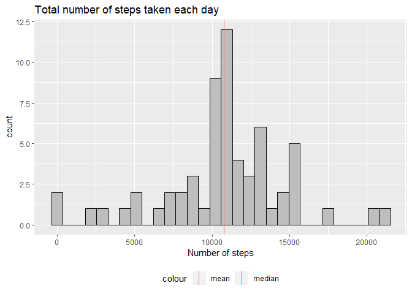
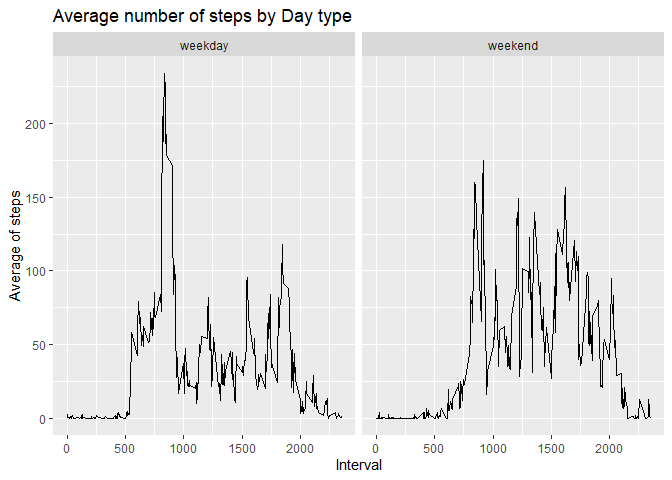

```r
library(dplyr)
library(ggplot2)
```

The data consists of two months of data from an anonymous individual collected during the months of October and November, 2012 and include the number of steps taken in 5 minute intervals each day. You can download the data here: [Activity monitoring data](https://d396qusza40orc.cloudfront.net/repdata%2Fdata%2Factivity.zip)

## Loading and preprocessing the data
Read data from csv file, and format the date fields as Date type.

```r
data <- read.csv("activity.csv", header = T)
data$date <- as.Date(data$date)
summary(data$steps)
```

```
##    Min. 1st Qu.  Median    Mean 3rd Qu.    Max.    NA's 
##    0.00    0.00    0.00   37.38   12.00  806.00    2304
```

## What is mean total number of steps taken per day?
Summarise the total number of steps taken per day and calculate some statistics.

```r
day_steps <- data %>% group_by(date) %>% summarise(total=sum(steps, na.rm = T))
```

The mean is: ``9354.2295082``
The median is: ``10395``

```r
ggplot(day_steps, aes(x=total)) +
  geom_histogram(color = "black", fill="gray") +
  labs(x="Number of steps", title="Total number of steps taken each day") +
  geom_vline(aes(xintercept=median(day_steps$total), color="median")) +
  geom_vline(aes(xintercept=mean(day_steps$total), color="mean")) + 
  theme(legend.position = "bottom")
```

<!-- -->

## What is the average daily activity pattern?
Summarise the average number of steps taken in every 5-minute interval for each day.

```r
interval_steps <- data %>% group_by(interval) %>% summarise(avg=mean(steps, na.rm = T))
```

The 5-minute interval ``835`` on average accross all the days in the dataset, contains the maximum number of steps

```r
ggplot(interval_steps, aes(x=interval, y=avg)) +
  geom_line() +
  labs(x="Interval", y="Average of steps", title="Average number of steps")
```

<!-- -->

## Imputing missing values
There are some missing values on data. The total missing rows are: ``2304``

Those missing values can introduce bias into some calculations, the mean of the interval can be used to fill those gaps.

```r
fill.na <- function(x){
  replace(x, is.na(x), mean(x, na.rm = T))
}
data_complete <- data %>% group_by(interval) %>% mutate(steps=fill.na(steps))
day_steps_complete <- data_complete %>% group_by(date) %>% summarise(total=sum(steps))
```

The mean is


- Filling NA's: ``1.0766189\times 10^{4}``
- Without filling NA's: ``9354.2295082``


The median is


- Filling NA's: ``1.0766189\times 10^{4}``
- Without filling NA's: ``10395``

```r
ggplot(day_steps_complete, aes(x=total)) +
  geom_histogram(color = "black", fill="gray") +
  labs(x="Number of steps", title="Total number of steps taken each day") +
  geom_vline(aes(xintercept=median(day_steps_complete$total), color="median")) +
  geom_vline(aes(xintercept=mean(day_steps_complete$total), color="mean")) + 
  theme(legend.position = "bottom")
```

<!-- -->

By filling the missing values with the mean of the interval, the overall mean of the dataset steps increased. The same happens to the median.

## Are there differences in activity patterns between weekdays and weekends?
To calculate if a date corresponds to weekday or weekend the function weekdays() is going to be used.

```r
data <- data %>% mutate(day.type=ifelse(grepl("^S",weekdays(date)), "weekend", "weekday"))
data$day.type <- as.factor(data$day.type)
interval_daytype_steps <- data %>% group_by(interval, day.type) %>% summarise(avg=mean(steps, na.rm = T))
```

In weekdays the average of steps is higher in the 5-minute intervals from 500 to 1000. In the weekend the average of steps increases by the end of the 5-minute intervals, in comparisson to weekdays.

```r
ggplot(interval_daytype_steps, aes(x=interval, y=avg)) +
  geom_line() +
  labs(x="Interval", y="Average of steps", title="Average number of steps by Day type") +
  facet_grid(cols = vars(day.type))
```

<!-- -->

